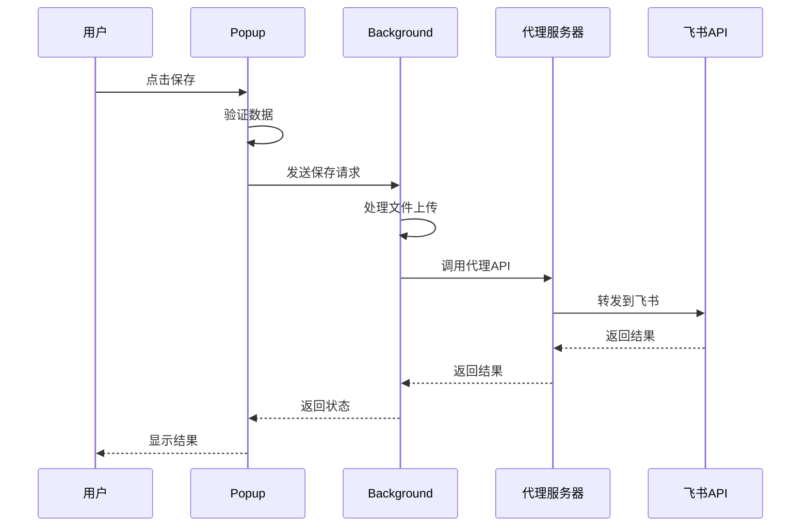
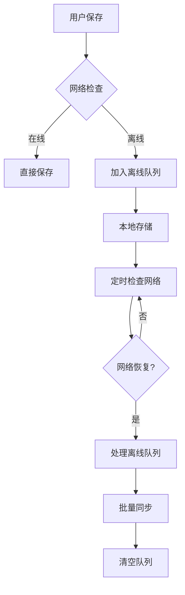

# 飞书网页收藏助手 - 技术设计文档 (TDD)

## 🏗️ 系统架构

### 整体架构图
```
┌─────────────────┐    ┌─────────────────┐    ┌─────────────────┐
│   Chrome 扩展   │────│   代理服务器     │────│   飞书 API      │
│   (前端界面)    │    │   (CORS处理)    │    │   (数据存储)    │
└─────────────────┘    └─────────────────┘    └─────────────────┘
         │                       │                       │
         │                       │                       │
    ┌─────────┐              ┌─────────┐            ┌─────────┐
    │ popup   │              │ Express │            │ 多维表格 │
    │options  │              │ Node.js │            │ 文件存储 │
    │background│              │ 代理转发 │            │ API服务  │
    └─────────┘              └─────────┘            └─────────┘
```

### 技术栈选择
- **前端**: HTML5 + CSS3 + Vanilla JavaScript
- **扩展框架**: Chrome Extension Manifest V3
- **后端代理**: Node.js + Express
- **数据存储**: 飞书多维表格
- **文件存储**: 飞书文件服务
- **部署**: Vercel/Railway (代理服务器)

## 📁 项目结构

```
chrome-extension-feishu/
├── manifest.json              # 扩展清单文件
├── popup.html                 # 弹窗界面
├── options.html               # 配置页面
├── js/                        
│   ├── background.js          # 后台服务工作者
│   ├── popup.js               # 弹窗逻辑
│   └── options.js             # 配置页面逻辑
├── css/
│   ├── popup.css              # 弹窗样式
│   └── options.css            # 配置页面样式
├── icons/                     # 扩展图标
│   ├── icon16.png
│   ├── icon32.png
│   ├── icon48.png
│   └── icon128.png
├── docs/                      # 文档目录
│   ├── 产品设计文档.md
│   ├── 技术设计文档.md
│   └── 对话历史记录.md
├── README.md                  # 项目说明
├── table-setup.md             # 表格配置说明
├── proxy-server-example.js    # 代理服务器示例
└── get-token.js               # 令牌获取脚本
```

## 🔧 核心模块设计

### 1. Manifest配置 (manifest.json)

```json
{
  "manifest_version": 3,
  "permissions": [
    "storage",        // 本地存储配置
    "tabs",          // 获取标签页信息  
    "scripting",     // 注入脚本
    "contextMenus",  // 右键菜单
    "notifications", // 系统通知
    "alarms",        // 定时任务
    "activeTab"      // 活动标签页
  ],
  "host_permissions": [
    "https://your-proxy-domain.com/*"  // 代理服务器权限
  ]
}
```

### 2. 后台服务 (background.js)

#### 核心类设计
```javascript
class FeishuBookmarkExtension {
  constructor() {
    this.apiConfig = {};      // API配置
    this.offlineQueue = [];   // 离线队列
  }
  
  // 核心方法
  init()                    // 初始化
  setupContextMenu()        // 右键菜单
  setupMessageHandlers()    // 消息处理
  saveToFeishu()           // 保存到飞书
  checkDuplicate()         // 重复检查
  uploadFiles()            // 文件上传
  processOfflineQueue()    // 离线队列处理
}
```

#### 数据流处理
```
用户操作 → popup.js → 
background.js → 数据预处理 → 
API调用 → 飞书服务 → 
结果反馈 → 用户界面
```

### 3. 用户界面 (popup.js)

#### 状态管理
```javascript
class PopupManager {
  constructor() {
    this.currentTab = null;           // 当前标签页
    this.tags = new Set();            // 标签集合
    this.projects = new Set();        // 项目集合  
    this.attachments = [];            // 附件列表
    this.isDetailedFormVisible = false; // 详细表单状态
  }
}
```

#### 事件处理流程
```
用户输入 → 数据验证 → 状态更新 → 
界面渲染 → 数据提交 → 结果处理
```

### 4. 配置管理 (options.js)

#### 配置项结构
```javascript
const apiConfig = {
  proxyUrl: '',             // 代理服务器地址
  appId: '',                // 飞书应用ID
  appSecret: '',            // 飞书应用密钥
  tableId: '',              // 多维表格ID
  tenantAccessToken: ''     // 访问令牌
};
```

## 🔄 数据流设计

### 保存流程


### 离线处理流程


## 🗄️ 数据结构设计

### 书签数据结构
```javascript
const bookmarkData = {
  url: 'https://example.com',           // 网页链接
  title: '页面标题',                     // 网站标题  
  notes: '用户备注',                     // 备注
  tags: ['标签1', '标签2'],              // 分类标签
  project: ['项目1'],                   // 关联项目
  attachments: [File对象],              // 关联文件
  createdTime: '2024-12-01T10:00:00Z',  // 创建时间
  lastUpdated: '2024-12-01T10:00:00Z'   // 最后更新时间
};
```

### 离线队列数据结构
```javascript
const queueItem = {
  id: '1701429600000',                  // 唯一ID
  data: bookmarkData,                   // 书签数据
  timestamp: 1701429600000,             // 时间戳
  retryCount: 0                         // 重试次数
};
```

## 🔐 安全设计

### API安全
```javascript
// 访问令牌管理
class TokenManager {
  async refreshToken() {
    // 自动刷新过期令牌
  }
  
  validateToken() {
    // 验证令牌有效性
  }
}

// API调用安全
const secureApiCall = async (endpoint, data) => {
  // 请求签名
  // 参数验证
  // 错误处理
};
```

### 数据验证
```javascript
// 输入验证
const validateInput = (data) => {
  return {
    url: validateUrl(data.url),
    title: sanitizeText(data.title),
    tags: validateTags(data.tags)
  };
};

// XSS防护
const escapeHtml = (text) => {
  const div = document.createElement('div');
  div.textContent = text;
  return div.innerHTML;
};
```

## 📊 性能优化

### 1. 加载优化
- 懒加载非关键组件
- 图片和资源压缩
- 代码分割和合并

### 2. 缓存策略
```javascript
// 配置缓存
const configCache = new Map();

// API响应缓存
const responseCache = new Map();

// 离线数据缓存
const offlineCache = new Map();
```

### 3. 异步处理
```javascript
// 并行处理
const parallelTasks = async (tasks) => {
  return Promise.all(tasks.map(task => task()));
};

// 防抖处理
const debounce = (func, delay) => {
  let timeoutId;
  return (...args) => {
    clearTimeout(timeoutId);
    timeoutId = setTimeout(() => func.apply(this, args), delay);
  };
};
```

## 🧪 测试策略

### 单元测试
```javascript
// URL规范化测试
describe('URL Normalization', () => {
  test('should remove tracking parameters', () => {
    const input = 'https://example.com?utm_source=google';
    const expected = 'https://example.com';
    expect(normalizeUrl(input)).toBe(expected);
  });
});

// 数据验证测试
describe('Data Validation', () => {
  test('should validate bookmark data', () => {
    const data = { url: 'invalid-url' };
    expect(() => validateBookmark(data)).toThrow();
  });
});
```

### 集成测试
```javascript
// API集成测试
describe('Feishu API Integration', () => {
  test('should save bookmark successfully', async () => {
    const bookmark = createTestBookmark();
    const result = await saveToFeishu(bookmark);
    expect(result.success).toBe(true);
  });
});
```

### 端到端测试
- Chrome扩展加载测试
- 用户界面交互测试
- 数据保存完整流程测试

## 📈 监控和日志

### 错误监控
```javascript
// 全局错误处理
window.addEventListener('error', (event) => {
  console.error('Global Error:', event.error);
  // 发送错误报告
});

// API错误追踪
const trackApiError = (endpoint, error) => {
  console.error(`API Error [${endpoint}]:`, error);
  // 记录错误统计
};
```

### 性能监控
```javascript
// 性能计时
const performanceTimer = {
  start: (label) => console.time(label),
  end: (label) => console.timeEnd(label)
};

// 使用统计
const trackUsage = (action, metadata) => {
  console.log(`Usage: ${action}`, metadata);
};
```

## 🚀 部署方案

### 代理服务器部署
```javascript
// Vercel 部署配置
// vercel.json
{
  "version": 2,
  "builds": [
    { "src": "proxy-server.js", "use": "@vercel/node" }
  ],
  "routes": [
    { "src": "/(.*)", "dest": "/proxy-server.js" }
  ]
}
```

### Chrome扩展发布
1. **本地测试**
   ```bash
   # 加载到Chrome
   chrome://extensions/ → 开发者模式 → 加载已解压的扩展程序
   ```

2. **打包发布**
   ```bash
   # 创建发布包
   zip -r extension.zip * -x "*.git*" "docs/*" "*.md"
   ```

3. **Chrome商店发布**
   - 注册开发者账号 ($5)
   - 上传扩展包
   - 填写商店信息
   - 等待审核

## 🔄 版本管理

### 版本号规则
- 主版本.次版本.修订版本 (如 1.0.0)
- manifest.json 中的版本号同步更新
- Git标签管理版本发布

### 更新策略
```javascript
// 自动更新检查
chrome.runtime.onUpdateAvailable.addListener(() => {
  // 提示用户更新
  chrome.runtime.reload();
});
```

## 📚 开发规范

### 代码规范
- ES6+ 语法
- 严格模式
- 一致的命名约定
- 详细的注释文档

### Git工作流
```bash
# 功能开发
git checkout -b feature/new-feature
git commit -m "feat: add new feature"
git push origin feature/new-feature

# 版本发布
git checkout main
git tag v1.0.0
git push origin v1.0.0
```

---

**版本**: v1.0  
**最后更新**: 2025年9月  
**维护者**: 技术开发团队